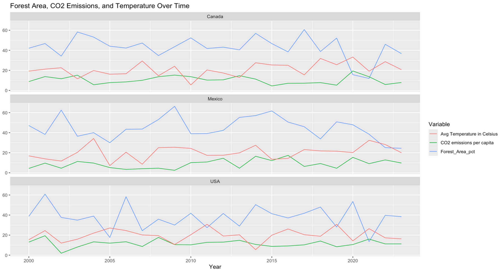
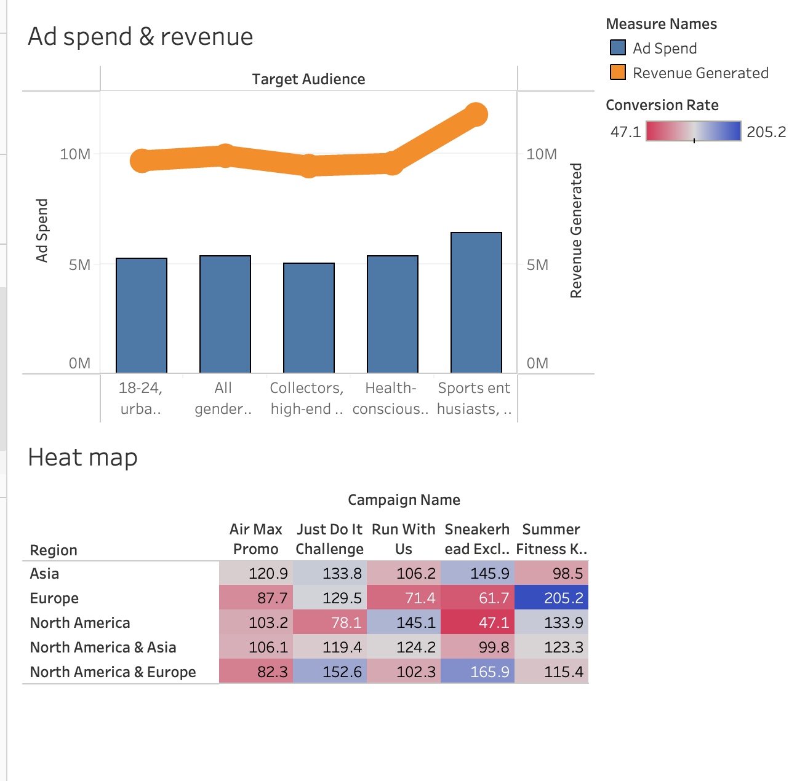

## Featured Projects

### Website Redesigns

A collection of landing page redesign projects, using Squarespace, Wix and Adobe Portfolio.

### Trauma Resource Institute Donation Landing Page

In collaboration with a Non-Profit Organization, Trauma Resource Institute the focus was to redesign their donation landing page to increase the organizations donations.

{fig-align="center"}

[Mock Donation Landing Page](https://jessicaag1998.wixsite.com/tridonate)

### CPP M.S Digital Marketing Landing Page

Created this landing page as a school project to redesign the landing page for the Digital Marketing graduate program at Cal Poly Pomona.

{fig-align="center"}

[M.S Digital Marketing landing page](https://jluciiag.wixsite.com/msdm)

### Data Visualizations

A collection of data-driven projects using RStudio and Tableau which features dashboards, consumer insights and forecasting models.

1.  Climate Change

    

    Climate Change Marketing Forecast 

    ​Using historical climate change data from Kaggle focusing on three countries: U.S, Canada and Mexico.
    We developed a climate forecasting model, analyzing key environmental indicators including forest area, CO₂ emissions, sea level, rainfall, and temperature.
    Applied **ARIMA** modeling in RStudio to generate short-term climate projections and support data-driven sustainability strategies.

2.  Nike Campaign Analysis

    

    Developed and designed an interactive Tableau dashboard to evaluate the performance of digital marketing campaigns for Nike, with a focus on key metrics such as **ROI** and **CTR**.
    The dashboard provided insights into customer behavior, enabling data-driven strategy optimization and enhanced campaign effectiveness.​​​​​​​​​​​​​​

### Ad Copies

A set of ad copies created to focus on driving traffic to a Non-Profit Organizations website and create conversions by using persuasive language and CTA.

{fig-align="center"}
